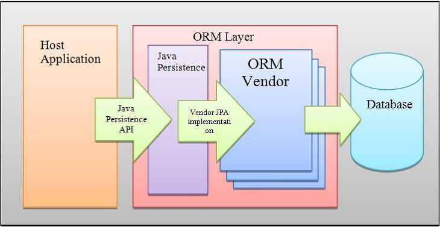

### Java Persistence API
This project is based on the Java EE (Java Persistence API or JPA) with the 
implementation EclipseLink, a JPA Framework that ease data persistence.

Several Java EE API was used specifically:
1. Servlet
2. Java Server Pages
3. Java Persistence API
4. JDBC

### Code sample from JPA

```java
public void insertToDB(T obj) {
  EntityManager em = emf.createEntityManager();
  try {
    em.getTransaction().begin();
    em.persist(obj);
    em.getTransaction().commit();
  }
  catch(Exception ex) {
    ex.getStackTrace();
  }
  finally {
    System.out.println("Row inserted");
    em.close();
  }
}
```
#### JPA Structure


